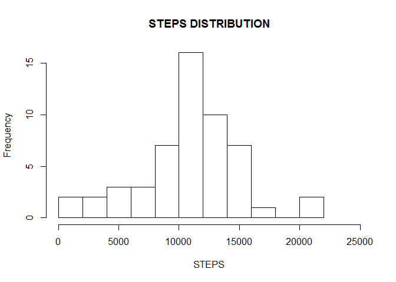
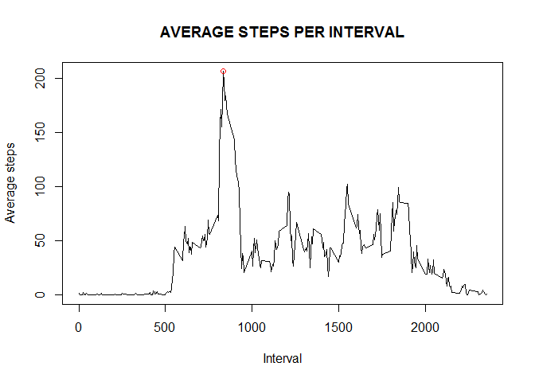
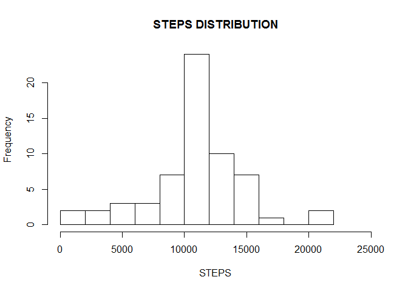
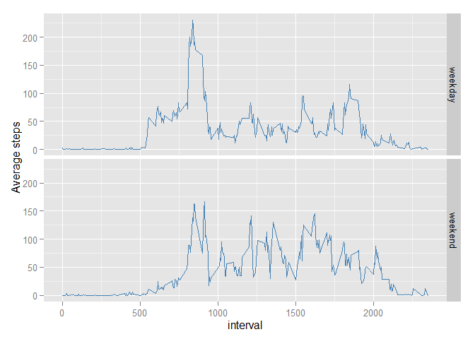

# Reproducible Research: Peer Assessment 1


## Loading and preprocessing the data

In this part, the file 'activity.zip' is unzipped & read into a dataframe. In addition, column 'date' is converted into date type. At last, NA's are removed.

```r
data        <- read.csv(unz("activity.zip", "activity.csv"))
data        <- transform(data, date= as.Date(date,"%Y-%m-%d"))
bad         <- is.na(data$steps)
cleandata   <- data[!bad,]
```


## What is mean total number of steps taken per day?

In order to answer this question, 'dplyr' package is used. Therefore, the first step is to load or install it, if it has not done it before.

```r
if(!require(dplyr)){
    install.packages("dplyr")
    library(dplyr)
}
```


First, using 'dplyr' package, total steps, median & mean per day are calculated. Then, it is presented a histogram of total steps.

```r
temp        <- group_by(cleandata,date)
summary1    <- summarise(temp, mean= mean(steps),median= median(steps), sum= sum(steps))

title       <- "STEPS DISTRIBUTION"
xlab        <- "STEPS"
h           <- hist(summary1$sum,breaks=10, xlim = c(0,25000), main=title, xlab=xlab)
```

 

The next step is to  report the mean and median of the total number of steps taken per day. In order to do so, it is used 'xtable' package. Thus, it is installed or loaded.

```r
if(!require(xtable)){
    install.packages("xtable")
    library(xtable)
}
```
Means & medians are reported:


```r
summary1<- transform(summary1, date=as.character(date))
xt<- xtable(summary1[,1:3])
align(xt) <- "cccc"
print(xt,type="html")
```

<!-- html table generated in R 3.1.2 by xtable 1.7-4 package -->
<!-- Sat Jul 18 11:22:23 2015 -->
<table border=1>
<tr> <th>  </th> <th> date </th> <th> mean </th> <th> median </th>  </tr>
  <tr> <td align="center"> 1 </td> <td align="center"> 2012-10-02 </td> <td align="center"> 0.44 </td> <td align="center"> 0.00 </td> </tr>
  <tr> <td align="center"> 2 </td> <td align="center"> 2012-10-03 </td> <td align="center"> 39.42 </td> <td align="center"> 0.00 </td> </tr>
  <tr> <td align="center"> 3 </td> <td align="center"> 2012-10-04 </td> <td align="center"> 42.07 </td> <td align="center"> 0.00 </td> </tr>
  <tr> <td align="center"> 4 </td> <td align="center"> 2012-10-05 </td> <td align="center"> 46.16 </td> <td align="center"> 0.00 </td> </tr>
  <tr> <td align="center"> 5 </td> <td align="center"> 2012-10-06 </td> <td align="center"> 53.54 </td> <td align="center"> 0.00 </td> </tr>
  <tr> <td align="center"> 6 </td> <td align="center"> 2012-10-07 </td> <td align="center"> 38.25 </td> <td align="center"> 0.00 </td> </tr>
  <tr> <td align="center"> 7 </td> <td align="center"> 2012-10-09 </td> <td align="center"> 44.48 </td> <td align="center"> 0.00 </td> </tr>
  <tr> <td align="center"> 8 </td> <td align="center"> 2012-10-10 </td> <td align="center"> 34.38 </td> <td align="center"> 0.00 </td> </tr>
  <tr> <td align="center"> 9 </td> <td align="center"> 2012-10-11 </td> <td align="center"> 35.78 </td> <td align="center"> 0.00 </td> </tr>
  <tr> <td align="center"> 10 </td> <td align="center"> 2012-10-12 </td> <td align="center"> 60.35 </td> <td align="center"> 0.00 </td> </tr>
  <tr> <td align="center"> 11 </td> <td align="center"> 2012-10-13 </td> <td align="center"> 43.15 </td> <td align="center"> 0.00 </td> </tr>
  <tr> <td align="center"> 12 </td> <td align="center"> 2012-10-14 </td> <td align="center"> 52.42 </td> <td align="center"> 0.00 </td> </tr>
  <tr> <td align="center"> 13 </td> <td align="center"> 2012-10-15 </td> <td align="center"> 35.20 </td> <td align="center"> 0.00 </td> </tr>
  <tr> <td align="center"> 14 </td> <td align="center"> 2012-10-16 </td> <td align="center"> 52.38 </td> <td align="center"> 0.00 </td> </tr>
  <tr> <td align="center"> 15 </td> <td align="center"> 2012-10-17 </td> <td align="center"> 46.71 </td> <td align="center"> 0.00 </td> </tr>
  <tr> <td align="center"> 16 </td> <td align="center"> 2012-10-18 </td> <td align="center"> 34.92 </td> <td align="center"> 0.00 </td> </tr>
  <tr> <td align="center"> 17 </td> <td align="center"> 2012-10-19 </td> <td align="center"> 41.07 </td> <td align="center"> 0.00 </td> </tr>
  <tr> <td align="center"> 18 </td> <td align="center"> 2012-10-20 </td> <td align="center"> 36.09 </td> <td align="center"> 0.00 </td> </tr>
  <tr> <td align="center"> 19 </td> <td align="center"> 2012-10-21 </td> <td align="center"> 30.63 </td> <td align="center"> 0.00 </td> </tr>
  <tr> <td align="center"> 20 </td> <td align="center"> 2012-10-22 </td> <td align="center"> 46.74 </td> <td align="center"> 0.00 </td> </tr>
  <tr> <td align="center"> 21 </td> <td align="center"> 2012-10-23 </td> <td align="center"> 30.97 </td> <td align="center"> 0.00 </td> </tr>
  <tr> <td align="center"> 22 </td> <td align="center"> 2012-10-24 </td> <td align="center"> 29.01 </td> <td align="center"> 0.00 </td> </tr>
  <tr> <td align="center"> 23 </td> <td align="center"> 2012-10-25 </td> <td align="center"> 8.65 </td> <td align="center"> 0.00 </td> </tr>
  <tr> <td align="center"> 24 </td> <td align="center"> 2012-10-26 </td> <td align="center"> 23.53 </td> <td align="center"> 0.00 </td> </tr>
  <tr> <td align="center"> 25 </td> <td align="center"> 2012-10-27 </td> <td align="center"> 35.14 </td> <td align="center"> 0.00 </td> </tr>
  <tr> <td align="center"> 26 </td> <td align="center"> 2012-10-28 </td> <td align="center"> 39.78 </td> <td align="center"> 0.00 </td> </tr>
  <tr> <td align="center"> 27 </td> <td align="center"> 2012-10-29 </td> <td align="center"> 17.42 </td> <td align="center"> 0.00 </td> </tr>
  <tr> <td align="center"> 28 </td> <td align="center"> 2012-10-30 </td> <td align="center"> 34.09 </td> <td align="center"> 0.00 </td> </tr>
  <tr> <td align="center"> 29 </td> <td align="center"> 2012-10-31 </td> <td align="center"> 53.52 </td> <td align="center"> 0.00 </td> </tr>
  <tr> <td align="center"> 30 </td> <td align="center"> 2012-11-02 </td> <td align="center"> 36.81 </td> <td align="center"> 0.00 </td> </tr>
  <tr> <td align="center"> 31 </td> <td align="center"> 2012-11-03 </td> <td align="center"> 36.70 </td> <td align="center"> 0.00 </td> </tr>
  <tr> <td align="center"> 32 </td> <td align="center"> 2012-11-05 </td> <td align="center"> 36.25 </td> <td align="center"> 0.00 </td> </tr>
  <tr> <td align="center"> 33 </td> <td align="center"> 2012-11-06 </td> <td align="center"> 28.94 </td> <td align="center"> 0.00 </td> </tr>
  <tr> <td align="center"> 34 </td> <td align="center"> 2012-11-07 </td> <td align="center"> 44.73 </td> <td align="center"> 0.00 </td> </tr>
  <tr> <td align="center"> 35 </td> <td align="center"> 2012-11-08 </td> <td align="center"> 11.18 </td> <td align="center"> 0.00 </td> </tr>
  <tr> <td align="center"> 36 </td> <td align="center"> 2012-11-11 </td> <td align="center"> 43.78 </td> <td align="center"> 0.00 </td> </tr>
  <tr> <td align="center"> 37 </td> <td align="center"> 2012-11-12 </td> <td align="center"> 37.38 </td> <td align="center"> 0.00 </td> </tr>
  <tr> <td align="center"> 38 </td> <td align="center"> 2012-11-13 </td> <td align="center"> 25.47 </td> <td align="center"> 0.00 </td> </tr>
  <tr> <td align="center"> 39 </td> <td align="center"> 2012-11-15 </td> <td align="center"> 0.14 </td> <td align="center"> 0.00 </td> </tr>
  <tr> <td align="center"> 40 </td> <td align="center"> 2012-11-16 </td> <td align="center"> 18.89 </td> <td align="center"> 0.00 </td> </tr>
  <tr> <td align="center"> 41 </td> <td align="center"> 2012-11-17 </td> <td align="center"> 49.79 </td> <td align="center"> 0.00 </td> </tr>
  <tr> <td align="center"> 42 </td> <td align="center"> 2012-11-18 </td> <td align="center"> 52.47 </td> <td align="center"> 0.00 </td> </tr>
  <tr> <td align="center"> 43 </td> <td align="center"> 2012-11-19 </td> <td align="center"> 30.70 </td> <td align="center"> 0.00 </td> </tr>
  <tr> <td align="center"> 44 </td> <td align="center"> 2012-11-20 </td> <td align="center"> 15.53 </td> <td align="center"> 0.00 </td> </tr>
  <tr> <td align="center"> 45 </td> <td align="center"> 2012-11-21 </td> <td align="center"> 44.40 </td> <td align="center"> 0.00 </td> </tr>
  <tr> <td align="center"> 46 </td> <td align="center"> 2012-11-22 </td> <td align="center"> 70.93 </td> <td align="center"> 0.00 </td> </tr>
  <tr> <td align="center"> 47 </td> <td align="center"> 2012-11-23 </td> <td align="center"> 73.59 </td> <td align="center"> 0.00 </td> </tr>
  <tr> <td align="center"> 48 </td> <td align="center"> 2012-11-24 </td> <td align="center"> 50.27 </td> <td align="center"> 0.00 </td> </tr>
  <tr> <td align="center"> 49 </td> <td align="center"> 2012-11-25 </td> <td align="center"> 41.09 </td> <td align="center"> 0.00 </td> </tr>
  <tr> <td align="center"> 50 </td> <td align="center"> 2012-11-26 </td> <td align="center"> 38.76 </td> <td align="center"> 0.00 </td> </tr>
  <tr> <td align="center"> 51 </td> <td align="center"> 2012-11-27 </td> <td align="center"> 47.38 </td> <td align="center"> 0.00 </td> </tr>
  <tr> <td align="center"> 52 </td> <td align="center"> 2012-11-28 </td> <td align="center"> 35.36 </td> <td align="center"> 0.00 </td> </tr>
  <tr> <td align="center"> 53 </td> <td align="center"> 2012-11-29 </td> <td align="center"> 24.47 </td> <td align="center"> 0.00 </td> </tr>
   </table>

## What is the average daily activity pattern?
By using 'dplyr' package, data is grouped by interval & then, average per interval is calculated & plotted.


```r
temp          <- group_by(cleandata,interval)
summary2      <- summarise(temp, steps=mean(steps))
aux           <- max(summary2$steps)
max           <- summary2[summary2$steps==aux,]
maxinterval   <- max[[1]]
title         <- "AVERAGE STEPS PER INTERVAL"
xlab          <- "Interval"
ylab          <- "Average steps" 
with(summary2, plot(interval,steps, type="l",main=title,xlab=xlab,ylab=ylab))
points(max[1],max[2],col="red")
```

 

The 5-minute interval, on average across all the days in the dataset that contains the maximum number of steps is 835.

## Imputing missing values
Total number of missing values in the dataset

```r
Total.NAs<- sum(is.na(data$steps))
Total.NAs
```

```
## [1] 2304
```

This portion of code replaces each missing value by the average value corresponding to the missing value's respective interval.

```r
data2<-data
for(i in seq(nrow(data2)))
{
    if(is.na(data2$steps[i]))
    {
        interval         <- data2$interval[i]
        temp             <- summary2[summary2$interval==interval,2]
        data2$steps[[i]] <- temp[[1]]
    }
}
```

With the new dataset, it is calculated the mean, median & total steps per day. It is presented the histogram of total steps.

```r
temp        <- group_by(data2,date)
summary3    <- summarise(temp, mean= mean(steps),median= median(steps), sum= sum(steps))
title       <- "STEPS DISTRIBUTION"
xlab        <- "STEPS"
hist(summary3$sum,breaks=10, xlim = c(0,25000), main=title, xlab=xlab)
```

 

Means & medians are reported:


```r
summary3<- transform(summary3, date=as.character(date))
xt<- xtable(summary3[,1:3])
align(xt) <- "cccc"
print(xt,type="html")
```

<!-- html table generated in R 3.1.2 by xtable 1.7-4 package -->
<!-- Sat Jul 18 11:22:23 2015 -->
<table border=1>
<tr> <th>  </th> <th> date </th> <th> mean </th> <th> median </th>  </tr>
  <tr> <td align="center"> 1 </td> <td align="center"> 2012-10-01 </td> <td align="center"> 37.38 </td> <td align="center"> 34.11 </td> </tr>
  <tr> <td align="center"> 2 </td> <td align="center"> 2012-10-02 </td> <td align="center"> 0.44 </td> <td align="center"> 0.00 </td> </tr>
  <tr> <td align="center"> 3 </td> <td align="center"> 2012-10-03 </td> <td align="center"> 39.42 </td> <td align="center"> 0.00 </td> </tr>
  <tr> <td align="center"> 4 </td> <td align="center"> 2012-10-04 </td> <td align="center"> 42.07 </td> <td align="center"> 0.00 </td> </tr>
  <tr> <td align="center"> 5 </td> <td align="center"> 2012-10-05 </td> <td align="center"> 46.16 </td> <td align="center"> 0.00 </td> </tr>
  <tr> <td align="center"> 6 </td> <td align="center"> 2012-10-06 </td> <td align="center"> 53.54 </td> <td align="center"> 0.00 </td> </tr>
  <tr> <td align="center"> 7 </td> <td align="center"> 2012-10-07 </td> <td align="center"> 38.25 </td> <td align="center"> 0.00 </td> </tr>
  <tr> <td align="center"> 8 </td> <td align="center"> 2012-10-08 </td> <td align="center"> 37.38 </td> <td align="center"> 34.11 </td> </tr>
  <tr> <td align="center"> 9 </td> <td align="center"> 2012-10-09 </td> <td align="center"> 44.48 </td> <td align="center"> 0.00 </td> </tr>
  <tr> <td align="center"> 10 </td> <td align="center"> 2012-10-10 </td> <td align="center"> 34.38 </td> <td align="center"> 0.00 </td> </tr>
  <tr> <td align="center"> 11 </td> <td align="center"> 2012-10-11 </td> <td align="center"> 35.78 </td> <td align="center"> 0.00 </td> </tr>
  <tr> <td align="center"> 12 </td> <td align="center"> 2012-10-12 </td> <td align="center"> 60.35 </td> <td align="center"> 0.00 </td> </tr>
  <tr> <td align="center"> 13 </td> <td align="center"> 2012-10-13 </td> <td align="center"> 43.15 </td> <td align="center"> 0.00 </td> </tr>
  <tr> <td align="center"> 14 </td> <td align="center"> 2012-10-14 </td> <td align="center"> 52.42 </td> <td align="center"> 0.00 </td> </tr>
  <tr> <td align="center"> 15 </td> <td align="center"> 2012-10-15 </td> <td align="center"> 35.20 </td> <td align="center"> 0.00 </td> </tr>
  <tr> <td align="center"> 16 </td> <td align="center"> 2012-10-16 </td> <td align="center"> 52.38 </td> <td align="center"> 0.00 </td> </tr>
  <tr> <td align="center"> 17 </td> <td align="center"> 2012-10-17 </td> <td align="center"> 46.71 </td> <td align="center"> 0.00 </td> </tr>
  <tr> <td align="center"> 18 </td> <td align="center"> 2012-10-18 </td> <td align="center"> 34.92 </td> <td align="center"> 0.00 </td> </tr>
  <tr> <td align="center"> 19 </td> <td align="center"> 2012-10-19 </td> <td align="center"> 41.07 </td> <td align="center"> 0.00 </td> </tr>
  <tr> <td align="center"> 20 </td> <td align="center"> 2012-10-20 </td> <td align="center"> 36.09 </td> <td align="center"> 0.00 </td> </tr>
  <tr> <td align="center"> 21 </td> <td align="center"> 2012-10-21 </td> <td align="center"> 30.63 </td> <td align="center"> 0.00 </td> </tr>
  <tr> <td align="center"> 22 </td> <td align="center"> 2012-10-22 </td> <td align="center"> 46.74 </td> <td align="center"> 0.00 </td> </tr>
  <tr> <td align="center"> 23 </td> <td align="center"> 2012-10-23 </td> <td align="center"> 30.97 </td> <td align="center"> 0.00 </td> </tr>
  <tr> <td align="center"> 24 </td> <td align="center"> 2012-10-24 </td> <td align="center"> 29.01 </td> <td align="center"> 0.00 </td> </tr>
  <tr> <td align="center"> 25 </td> <td align="center"> 2012-10-25 </td> <td align="center"> 8.65 </td> <td align="center"> 0.00 </td> </tr>
  <tr> <td align="center"> 26 </td> <td align="center"> 2012-10-26 </td> <td align="center"> 23.53 </td> <td align="center"> 0.00 </td> </tr>
  <tr> <td align="center"> 27 </td> <td align="center"> 2012-10-27 </td> <td align="center"> 35.14 </td> <td align="center"> 0.00 </td> </tr>
  <tr> <td align="center"> 28 </td> <td align="center"> 2012-10-28 </td> <td align="center"> 39.78 </td> <td align="center"> 0.00 </td> </tr>
  <tr> <td align="center"> 29 </td> <td align="center"> 2012-10-29 </td> <td align="center"> 17.42 </td> <td align="center"> 0.00 </td> </tr>
  <tr> <td align="center"> 30 </td> <td align="center"> 2012-10-30 </td> <td align="center"> 34.09 </td> <td align="center"> 0.00 </td> </tr>
  <tr> <td align="center"> 31 </td> <td align="center"> 2012-10-31 </td> <td align="center"> 53.52 </td> <td align="center"> 0.00 </td> </tr>
  <tr> <td align="center"> 32 </td> <td align="center"> 2012-11-01 </td> <td align="center"> 37.38 </td> <td align="center"> 34.11 </td> </tr>
  <tr> <td align="center"> 33 </td> <td align="center"> 2012-11-02 </td> <td align="center"> 36.81 </td> <td align="center"> 0.00 </td> </tr>
  <tr> <td align="center"> 34 </td> <td align="center"> 2012-11-03 </td> <td align="center"> 36.70 </td> <td align="center"> 0.00 </td> </tr>
  <tr> <td align="center"> 35 </td> <td align="center"> 2012-11-04 </td> <td align="center"> 37.38 </td> <td align="center"> 34.11 </td> </tr>
  <tr> <td align="center"> 36 </td> <td align="center"> 2012-11-05 </td> <td align="center"> 36.25 </td> <td align="center"> 0.00 </td> </tr>
  <tr> <td align="center"> 37 </td> <td align="center"> 2012-11-06 </td> <td align="center"> 28.94 </td> <td align="center"> 0.00 </td> </tr>
  <tr> <td align="center"> 38 </td> <td align="center"> 2012-11-07 </td> <td align="center"> 44.73 </td> <td align="center"> 0.00 </td> </tr>
  <tr> <td align="center"> 39 </td> <td align="center"> 2012-11-08 </td> <td align="center"> 11.18 </td> <td align="center"> 0.00 </td> </tr>
  <tr> <td align="center"> 40 </td> <td align="center"> 2012-11-09 </td> <td align="center"> 37.38 </td> <td align="center"> 34.11 </td> </tr>
  <tr> <td align="center"> 41 </td> <td align="center"> 2012-11-10 </td> <td align="center"> 37.38 </td> <td align="center"> 34.11 </td> </tr>
  <tr> <td align="center"> 42 </td> <td align="center"> 2012-11-11 </td> <td align="center"> 43.78 </td> <td align="center"> 0.00 </td> </tr>
  <tr> <td align="center"> 43 </td> <td align="center"> 2012-11-12 </td> <td align="center"> 37.38 </td> <td align="center"> 0.00 </td> </tr>
  <tr> <td align="center"> 44 </td> <td align="center"> 2012-11-13 </td> <td align="center"> 25.47 </td> <td align="center"> 0.00 </td> </tr>
  <tr> <td align="center"> 45 </td> <td align="center"> 2012-11-14 </td> <td align="center"> 37.38 </td> <td align="center"> 34.11 </td> </tr>
  <tr> <td align="center"> 46 </td> <td align="center"> 2012-11-15 </td> <td align="center"> 0.14 </td> <td align="center"> 0.00 </td> </tr>
  <tr> <td align="center"> 47 </td> <td align="center"> 2012-11-16 </td> <td align="center"> 18.89 </td> <td align="center"> 0.00 </td> </tr>
  <tr> <td align="center"> 48 </td> <td align="center"> 2012-11-17 </td> <td align="center"> 49.79 </td> <td align="center"> 0.00 </td> </tr>
  <tr> <td align="center"> 49 </td> <td align="center"> 2012-11-18 </td> <td align="center"> 52.47 </td> <td align="center"> 0.00 </td> </tr>
  <tr> <td align="center"> 50 </td> <td align="center"> 2012-11-19 </td> <td align="center"> 30.70 </td> <td align="center"> 0.00 </td> </tr>
  <tr> <td align="center"> 51 </td> <td align="center"> 2012-11-20 </td> <td align="center"> 15.53 </td> <td align="center"> 0.00 </td> </tr>
  <tr> <td align="center"> 52 </td> <td align="center"> 2012-11-21 </td> <td align="center"> 44.40 </td> <td align="center"> 0.00 </td> </tr>
  <tr> <td align="center"> 53 </td> <td align="center"> 2012-11-22 </td> <td align="center"> 70.93 </td> <td align="center"> 0.00 </td> </tr>
  <tr> <td align="center"> 54 </td> <td align="center"> 2012-11-23 </td> <td align="center"> 73.59 </td> <td align="center"> 0.00 </td> </tr>
  <tr> <td align="center"> 55 </td> <td align="center"> 2012-11-24 </td> <td align="center"> 50.27 </td> <td align="center"> 0.00 </td> </tr>
  <tr> <td align="center"> 56 </td> <td align="center"> 2012-11-25 </td> <td align="center"> 41.09 </td> <td align="center"> 0.00 </td> </tr>
  <tr> <td align="center"> 57 </td> <td align="center"> 2012-11-26 </td> <td align="center"> 38.76 </td> <td align="center"> 0.00 </td> </tr>
  <tr> <td align="center"> 58 </td> <td align="center"> 2012-11-27 </td> <td align="center"> 47.38 </td> <td align="center"> 0.00 </td> </tr>
  <tr> <td align="center"> 59 </td> <td align="center"> 2012-11-28 </td> <td align="center"> 35.36 </td> <td align="center"> 0.00 </td> </tr>
  <tr> <td align="center"> 60 </td> <td align="center"> 2012-11-29 </td> <td align="center"> 24.47 </td> <td align="center"> 0.00 </td> </tr>
  <tr> <td align="center"> 61 </td> <td align="center"> 2012-11-30 </td> <td align="center"> 37.38 </td> <td align="center"> 34.11 </td> </tr>
   </table>

### Do these values differ from the estimates from the first part of the assignment?
No, they don't. Medians & means did not change.

### What is the impact of imputing missing data on the estimates of the total daily number of steps?
These new artificial data could bias any further analysis.

## Are there differences in activity patterns between weekdays and weekends?
In order to answer this question, first it is necessary to classify each row by 'weekday' or 'weekend'. This is accomplished by the means of the function 'classifier'. After each row is classified, it is created a new column of factor type that contains the classification. Finally, by using 'dplyr' package, it is calculated the mean of steps grouped by interval & whether is weekday or weekend.


```r
dates        <- weekdays(data2$date)
classifier   <- function(x){
    if(x=="Saturday" || x=="Sunday")
        "weekend"
    else{
        "weekday"
    }
}
aux                <-unname(sapply(dates, classifier))
data2$Day.Class    <-factor(aux)

temp<- group_by(data2,interval,Day.Class)
summary4<- summarise(temp, steps=mean(steps))
```

A suitable package for making the comparison graph is 'ggplot2'.

```r
if(!require(ggplot2)){
    install.packages("ggplot2")
    library(ggplot2)
}
```


```r
g<- ggplot(summary4,aes(interval,steps))
g<- g + geom_line(color="steelblue")
g<- g + facet_grid(Day.Class~.)
g<- g + labs(y="Average steps")
g
```

 
